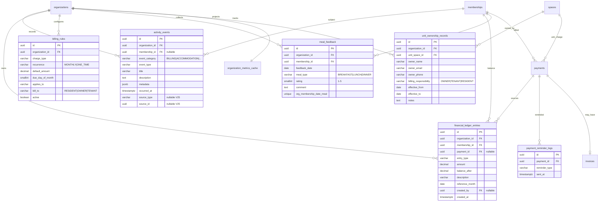
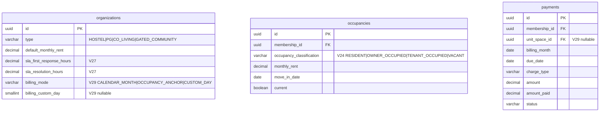

# Dwellio V1 Deepening — Entity Relationship Diagram

Mermaid ERD for tables and cache columns added during Phases A–G. Core V1 tables (`organizations`, `memberships`, `occupancies`, `payments`, `complaints`) are shown with new relationships only.

---

## Deepening tables



---

## Extended organization & occupancy



---

## Metrics cache extensions

`organization_metrics_cache` is 1:1 with `organizations`. Key deepening columns:

```mermaid
erDiagram
    organization_metrics_cache {
        uuid organization_id PK_FK
        decimal expected_revenue_month "V22"
        decimal collected_revenue_month "V22"
        decimal outstanding_revenue_month "V22"
        decimal collection_rate "V22"
        int defaulters_count "V22"
        jsonb revenue_trend_json "V22"
        decimal forecast_revenue_next_month "V22"
        int move_ins_month "V26"
        int move_outs_month "V26"
        decimal avg_stay_days "V26"
        decimal turnover_rate "V26"
        int pending_payments_count "V26"
        decimal sla_first_response_hours "V26"
        decimal sla_resolution_hours "V26"
        decimal sla_compliance_rate "V26"
        int sla_violations_count "V26"
        int reopened_complaints_count "V26"
        decimal avg_breakfast_rating "V26"
        decimal avg_lunch_rating "V26"
        decimal avg_dinner_rating "V26"
        jsonb meal_ratings_trend_json "V26"
        timestamptz refreshed_at
    }
```

---

## Migration index

| Version | Phase | Contents |
|---------|-------|----------|
| V22 | Revenue / ledger | `financial_ledger_entries`, `billing_rules`, `payment_reminder_logs`, revenue cache columns |
| V23 | Timeline | `activity_events` |
| V24 | Gated ownership | `unit_ownership_records`, `occupancy_classification` |
| V25 | Timeline dedupe | `activity_events.source_type`, `source_id`, unique index |
| V26 | Metrics B | Lifecycle, SLA, meal rating cache columns |
| V27 | Complaint SLA | `organizations.sla_*_hours` |
| V28 | Meal feedback | `meal_feedback` |
| V29 | Billing engine | `organizations.billing_mode`, `payments.unit_space_id`, rule seed |

---

## Key flows

### Rent charge (hostel/PG/co-living)

```
occupancies (current) → PaymentService.syncMonthlyPayments
  → payments (RENT)
  → financial_ledger_entries (CHARGE_GENERATED)
  → activity_events (BILLING)
  → notifications (PAYMENT_DUE)
```

### Gated maintenance

```
billing_rules (MAINTENANCE) + BillToResolver
  → payments (MAINTENANCE, unit_space_id)
  → financial_ledger_entries
  → activity_events
  → metrics refresh
```

### Metrics rebuild

```
POST /metrics/rebuild
  → RevenueMetricsProjection
  → LifecycleMetricsProjection
  → ComplaintSlaProjection
  → MealMetricsProjection
  → ActivityEventBackfillService
  → organization_metrics_cache
```

---

## Related documents

- [payment-v2-deepening.md](./payment-v2-deepening.md) — behavioral specification
- [payment-v1-spec.md](./payment-v1-spec.md) — original V1 scope
