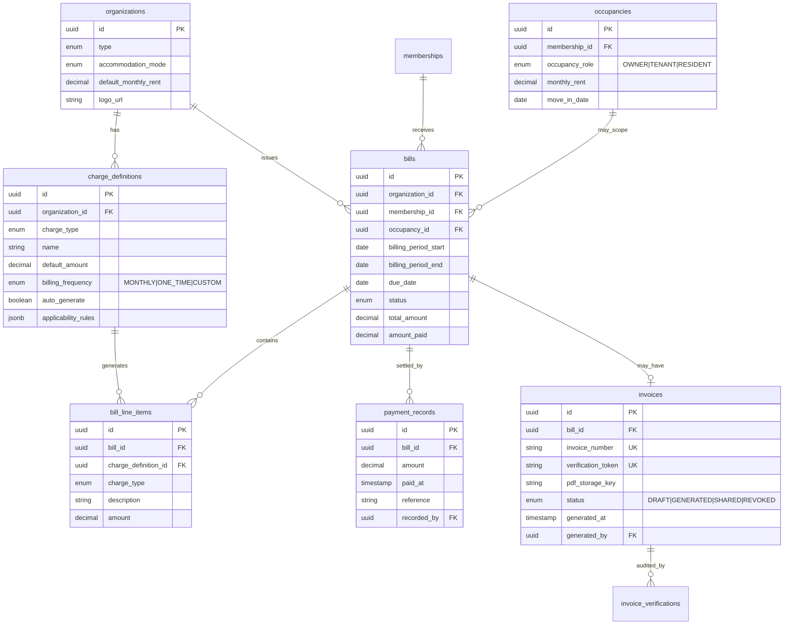

# Dwellio Unified Payment Architecture

Design document for a generic financial system supporting all organization types. **No implementation code** — architecture only.

---

## 1. Goals

| Goal | Approach |
|------|----------|
| One system for all org types | Generic **Charge** + **Bill** model |
| Different payment models per type | **Charge templates** + org-type defaults |
| Owner vs tenant (gated) | **Occupancy role** extension on existing occupancy |
| Recurring + one-time | **Billing schedule** on charge definitions |
| No per-type hardcoding | Configurable charge categories and assignment rules |

---

## 2. ERD (Conceptual)



---

## 3. New Tables / Entities

| Table | Purpose |
|-------|---------|
| `charge_definitions` | Recurring or one-time charge templates per org |
| `bills` | A billing document for a resident for a period |
| `bill_line_items` | Individual charges on a bill |
| `payment_records` | Manual payment entries against bills |
| `invoices` | Generated PDF receipts with verification |
| `invoice_verifications` | Audit log of verification attempts |
| `occupancy_roles` (or column) | OWNER / TENANT on occupancies |

**Extend existing:**

| Table | New columns |
|-------|-------------|
| `organizations` | `logo_url`, `billing_profile_json` |
| `occupancies` | `occupancy_role`, `monthly_rent` (done in V13) |
| `payments` (current) | Migrate → `bills` + `payment_records` in V2 of payments |

---

## 4. Enums

### ChargeType
```
RENT | MAINTENANCE | UTILITY | PENALTY | DEPOSIT | PARKING | AMENITY | OTHER
```

### BillingFrequency
```
MONTHLY | ONE_TIME | QUARTERLY | ANNUAL
```

### BillStatus (replaces narrow PaymentStatus)
```
DRAFT | PENDING | PARTIALLY_PAID | PAID | OVERDUE | CANCELLED
```

### OccupancyRole (extension)
```
RESIDENT | OWNER | TENANT
```
- **HOSTEL/PG/CO_LIVING**: always `RESIDENT`
- **GATED_COMMUNITY**: `OWNER` or `TENANT` per occupancy

### InvoiceStatus
```
DRAFT | GENERATED | SHARED | REVOKED
```

### InvoiceVerificationResult
```
VERIFIED | INVALID | REVOKED | NOT_FOUND
```

---

## 5. API Design

### Charge definitions (owner/staff)
| Method | Path | Description |
|--------|------|-------------|
| GET | `/organizations/{id}/charges/definitions` | List charge templates |
| POST | `/organizations/{id}/charges/definitions` | Create template |
| PATCH | `/organizations/{id}/charges/definitions/{defId}` | Update |
| DELETE | `/organizations/{id}/charges/definitions/{defId}` | Soft delete |

### Bills
| Method | Path | Description |
|--------|------|-------------|
| GET | `/organizations/{id}/bills` | Owner: all bills (filter by status, resident) |
| GET | `/organizations/{id}/bills/mine` | Resident: own bills |
| POST | `/organizations/{id}/bills/generate` | Generate bills for period |
| POST | `/organizations/{id}/bills` | Create one-time manual bill |
| GET | `/organizations/{id}/bills/{billId}` | Bill detail + line items |

### Payments (manual recording)
| Method | Path | Description |
|--------|------|-------------|
| POST | `/organizations/{id}/bills/{billId}/payments` | Record partial/full payment |
| PATCH | `/organizations/{id}/bills/{billId}/status` | Mark unpaid / cancel |

### Invoices
| Method | Path | Description |
|--------|------|-------------|
| POST | `/organizations/{id}/bills/{billId}/invoice` | Generate PDF (owner only) |
| POST | `/organizations/{id}/bills/{billId}/invoice/share` | Push to resident |
| GET | `/organizations/{id}/invoices/{invoiceId}/pdf` | Download |
| GET | `/public/invoices/verify` | Verify by number + token / QR |

### Recurring billing job
| Internal | `BillingScheduler` | Nightly: auto-generate monthly bills per rules |

---

## 6. Recurring Billing Design

```
For each ACTIVE occupancy:
  For each charge_definition WHERE auto_generate = true AND applicable:
    If billing period not yet billed:
      Create bill (status = PENDING or OVERDUE)
      Add line_item from definition or occupancy.monthly_rent
      due_date = move_in anniversary day in billing month
      Notify resident if OVERDUE
```

### Applicability rules (JSON)
```json
{
  "orgTypes": ["HOSTEL", "PG"],
  "occupancyRoles": ["RESIDENT"],
  "accommodationModes": ["BED_BASED"]
}
```

### Org-type defaults (seeded on org creation)

| Org type | Auto recurring | Default charges |
|----------|----------------|-----------------|
| HOSTEL/PG/CO_LIVING | RENT (monthly) | RENT from `occupancy.monthly_rent` |
| GATED_COMMUNITY | None in V1 | Manual MAINTENANCE, PARKING, etc. |

---

## 7. Owner vs Tenant Handling

| Role | Typical charges | Auto recurring V1 |
|------|-----------------|-------------------|
| OWNER | Maintenance, sinking fund, parking | Manual only |
| TENANT | Rent (optional), maintenance (optional) | Manual only |
| RESIDENT (hostel) | Bed rent | Auto monthly |

**Extension point:** `occupancies.occupancy_role` — does not replace membership; gated units may have owner-occupant vs tenant-occupant with different charge applicability.

---

## 8. Migration Strategy

| Phase | Action |
|-------|--------|
| V13 (current) | `occupancies.monthly_rent`, per-occupancy billing |
| V14 | Add `charge_definitions`, `bills`, `bill_line_items` |
| V15 | Migrate `payments` table rows → `bills` + `payment_records` |
| V16 | Add `invoices`, verification |
| V17 | Add `organizations.logo_url`, upload API |
| Deprecate | Old `payments` entity after data migration |

---

## 9. Frontend Pages

| Audience | Page | Purpose |
|----------|------|---------|
| Owner | `/operations/payments` | Dues list, mark paid, manual charges |
| Owner | `/operations/payments/charges` | Create one-time / recurring definitions |
| Owner | `/operations/payments/{billId}` | Detail + Generate Invoice |
| Resident | `/resident/payments` | My bills, balance, history |
| Public | `/verify-invoice` | QR / token verification |
| Owner | Org settings | Logo upload, default rent |
| Admin | Platform billing oversight (future) | — |

---

## 10. Design Principles

1. **Bills are the unit of work** — not raw payments
2. **Charge definitions are templates** — amounts can override per bill
3. **Org type drives defaults** — not separate code paths
4. **Manual-first V1** — no payment gateways
5. **Invoice is optional and owner-triggered** — never auto-sent
