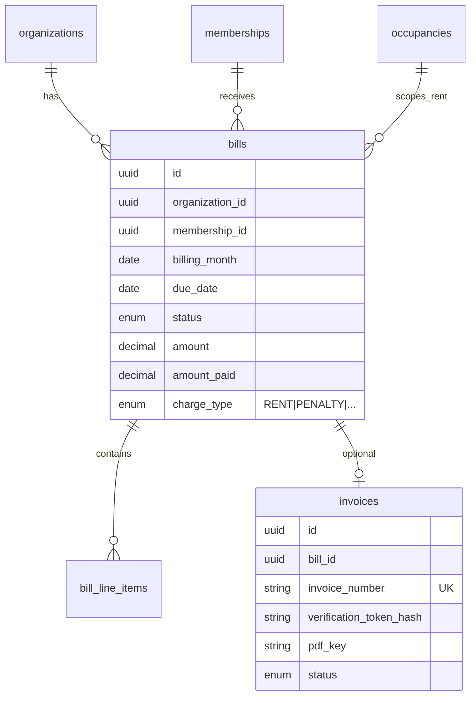

# Dwellio V1 Payment & Invoice Specification

Simplified payment scope for first release. Builds on [payment-architecture.md](./payment-architecture.md) but constrains V1 to essentials.

**V2 deepening (ledger, revenue, billing rules, timeline, etc.) is documented in [payment-v2-deepening.md](./payment-v2-deepening.md).**

**No implementation code in this document.**

---

## 1. V1 Scope Summary

| In scope | Out of scope |
|----------|--------------|
| Per-occupancy monthly rent (hostel/PG/co-living) | Payment gateways |
| Manual additional charges | Full accounting / ledger |
| Due notifications | Tax calculations |
| Owner marks paid / partial / unpaid | Advanced financial reporting |
| Owner-triggered invoice PDF | Auto-sent invoices |
| Invoice verification portal | Complex recurring rules engine |

---

## 2. Organization Logo

### On org creation / settings
- Optional logo upload: JPG, JPEG, PNG, WEBP
- Max size: 2 MB (recommended)
- Stored: object storage key on `organizations.logo_url`
- UI: placeholder when missing

### Display locations
- Operations header, resident home, public org profile, invoice PDF

---

## 3. HOSTEL / PG / CO_LIVING

### Automatic recurring rent
| Rule | Detail |
|------|--------|
| Amount source | `occupancies.monthly_rent` (set at allocation) |
| Fallback | `organizations.default_monthly_rent` → platform default |
| Billing anchor | Resident `move_in_date` day-of-month |
| Generation | On-demand sync + nightly job |
| Status flow | PENDING → OVERDUE (after due) → PARTIALLY_PAID → PAID |

### Owner actions
- View all dues with color coding
- Mark paid / unpaid / partial amount
- View payment history per resident

### Resident actions
- View own dues and history
- Receive `PAYMENT_DUE` notifications (max 1/day per bill)

### Manual additional charges
Owner creates one-time charge:

| Field | Example |
|-------|---------|
| charge_type | PENALTY, UTILITY, OTHER |
| amount | ₹500 |
| description | Laundry charge |
| assign_to | single resident / multiple / all active |

Creates a **bill** with one line item (not mixed into rent bill unless grouped).

---

## 4. GATED_COMMUNITY (V1)

- **No automatic recurring billing**
- Owner manually creates charges:
  - MAINTENANCE, PARKING, PENALTY, UTILITY, OTHER
- Assign to:
  - Specific resident (membership)
  - Specific unit (current occupancy)
  - All residents (bulk)

---

## 5. Invoice / Receipt (V1)

### Generation flow
```
Payment marked PAID (or PARTIALLY_PAID with owner choice)
  → Owner sees "Generate Invoice" button
  → Owner clicks → system creates PDF + invoice record
  → Owner clicks "Share with resident" → resident can download
```

**Never auto-generate or auto-send.**

### Invoice record
| Field | Description |
|-------|-------------|
| invoice_number | `INV-{ORG_SLUG}-{YYYYMM}-{SEQ}` |
| verification_token | Cryptographic random, stored hashed |
| qr_payload | URL: `/verify-invoice?n=...&t=...` |
| pdf_storage_key | S3 / local storage path |
| status | GENERATED → SHARED → REVOKED |

### Standardized PDF layout (fixed template)
```
┌─────────────────────────────────────────────┐
│ [LOGO]     ORGANIZATION NAME                │
│            Address line                     │
│─────────────────────────────────────────────│
│ INVOICE #: INV-...    Date: ...             │
│ Resident: ...          Unit/Bed: ...          │
│─────────────────────────────────────────────│
│ Charge type: Rent                           │
│ Billing period: Jun 2026                    │
│ Amount due: ₹8,000   Amount paid: ₹8,000    │
│ Payment date: ...    Status: PAID           │
│ Reference: ...                              │
│─────────────────────────────────────────────│
│ [QR CODE]  Verify at dwellio.app/verify...  │
│ Security ID: DWL-XXXX-XXXX (non-forgeable)  │
│─────────────────────────────────────────────│
│ System-generated receipt — not a tax invoice│
└─────────────────────────────────────────────┘
```

### Security
- HMAC-signed verification token tied to invoice ID + amount + org
- QR links to public verification page
- Verification page shows: invoice #, org, resident, date, amount, status, VERIFIED/INVALID/REVOKED
- Audit log: `invoice_verifications` (timestamp, IP, result)

---

## 6. V1 ERD (Minimal)



**V1 uses simplified `bills` table** (can evolve from current `payments` table).

---

## 7. V1 API (Minimal)

| Endpoint | V1 |
|----------|-----|
| `GET /organizations/{id}/bills` | List org bills |
| `GET /organizations/{id}/bills/mine` | Resident bills |
| `PATCH /organizations/{id}/bills/{id}` | Update paid amount / status |
| `POST /organizations/{id}/bills/manual` | Create one-time charge |
| `POST /organizations/{id}/bills/{id}/invoice` | Generate PDF |
| `POST /organizations/{id}/bills/{id}/invoice/share` | Notify resident |
| `GET /organizations/{id}/invoices/{id}/pdf` | Download |
| `GET /public/invoices/verify` | Public verification |
| `POST /organizations/{id}/logo` | Upload logo |
| `PATCH /organizations/{id}/occupancies/{id}/rent` | Update monthly rent |

---

## 8. V1 Frontend Pages

| Page | Features |
|------|----------|
| Operations → Payments | Colored dues list, mark paid, manual charge dialog |
| Operations → Payments → [bill] | Generate/share invoice |
| Resident → Rent | Own bills, status colors |
| Org Settings | Logo upload, default monthly rent |
| `/verify-invoice` | Public QR landing |
| Allocate resident | Monthly rent input (implemented) |

---

## 9. Migration from Current `payments` Table

| Current | V1 target |
|---------|-----------|
| `payments` | Rename/extend to `bills` |
| `amount` | `bills.amount` |
| `amount_paid` | `bills.amount_paid` |
| `billing_month` | `bills.billing_month` |
| `status` | Align to BillStatus enum |
| New | `charge_type` column (default RENT) |
| New | `invoices` table |

---

## 10. Implementation Order (Recommended)

1. ✅ Per-occupancy `monthly_rent` on allocation (V13)
2. Manual charge creation API + UI
3. Logo upload on org settings
4. Invoice generation service (PDF template)
5. Verification portal
6. Migrate `payments` → `bills` naming alignment
7. Full charge_definitions (post-V1)
